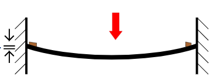

# Theory:

Elastic elements, when subjected to pressure, get deformed. The deformation, when measured, gives an indication of the pressure. These elements may be in the form of diaphragms, capsules, bellows, Bourdon or helical tubes. The deformation may be measured by mechanical or electrical means. These devices are convenient to use and can cover a wide range of pressure, depending on the design of the elastic elements.

It is known that an elastic diaphragm would remain linear for small deflections only and for this purpose, maximum deflection y should be < t/3, t being the diaphragm thickness.
From strength and elasticity of materials, it is seen that deflection y at radius r of a circular diaphragm clamped at its outer periphery is given by

 ----(1)

where p is the pressure on the diaphragm, 
  radius R, 
  thickness t,  
  E being Young's modulus of the diaphragm material = 2.07 X 105 and  
  ν its Poisson's ratio = 0.25. 

 -----(2) 

A special purpose strain gauge rosette which has been designed to take advantages of this strain distribution, is widely used in diaphragm type pressure transducer. Two strain gauges will be at the center of diaphragm where tangential strain will be maximum. Similarly, two strain gauges are installed at the edge of the diaphragm where radial strain is maximum.

 -----(3) 

 -----(4) 
 ------(5) 
 ------(6) 
 ------(7) 

Strain gauges R2 and R4 are oriented to read the radial strain and placed as close to the edge as possible, since the radial strain has maximum negative value at this point.
Strain gauges R1 and R3 are installed as close to the center as possible and it will read tangential strain, since it is maximum at this point.

### Signal conditioning : 

In Wheatstone bridge tangential elements are in arm R1 and R3 and the radial elements are in arm R2 and R4. So the output voltages Eo for diaphragm sensor using strain gauge rosette supplied by the manufacturer is as 

 -----(8) 

where, Eb = supply voltage,
 F = gauge factor